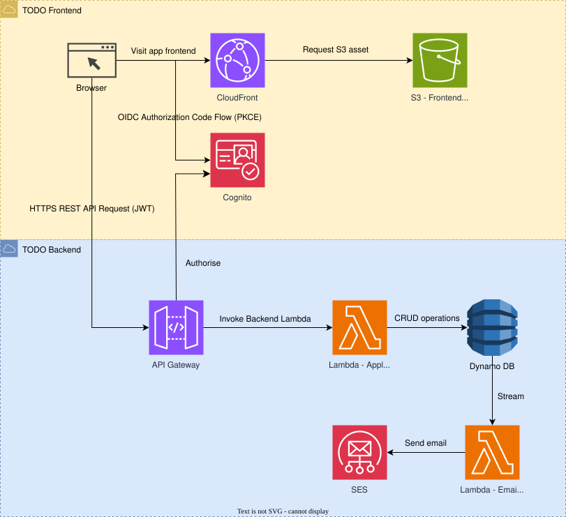

## Todo App Infrastructure (AWS CDK)

Infrastructure for the Todo App using AWS CDK (TypeScript). It provisions backend and frontend stacks, including API, DynamoDB tables, Cognito auth, CloudFront, and supporting SSM parameters.

### TL;DR



## Repo contents

- `bin/`: CDK app entrypoint.
- `lib/`: CDK stacks for backend API, reminders, frontend hosting, and backend CI pipeline.
- `todo-arch-layout.svg`: Architecture overview diagram.

## Infrastructure

### Prerequisites

- Node.js 20+
- AWS CDK v2
- AWS credentials with permissions to deploy Lambda, API Gateway, DynamoDB, S3, CloudFront, ACM, IAM, and optionally SES

### Stacks

- `TodoApiStack`: Backend API Lambda + API Gateway + DynamoDB table.
- `ReminderStack`: Reminder Lambda + DynamoDB stream processing for reminders.
- `FrontendStack`: S3 + CloudFront hosting, origin access, and TLS support.
- `FrontendCertStack`: ACM certificate in `us-east-1` for CloudFront.
- `BackendPipelineStack`: CodePipeline + CodeBuild for backend deploys.

### Configuration

- `lib/config/shared.ts`: Shared domains and SSM base paths.
- `lib/config/backend/config.api.ts`: API domain and Lambda settings.
- `lib/config/backend/config.dynamodb.ts`: DynamoDB table configuration.
- `lib/config/frontend/config.fe.ts`: Frontend domain and asset settings.
- `lib/config/ci/config.ci.ts`: CI artifact keys and GitHub OIDC repo settings.

### CI/CD overview

- Frontend CI runs in GitHub Actions: build artifact, clear S3, upload artifact to S3, then invalidate CloudFront cache.
- Backend CI is handled by `lib/ci/backend-pipeline-stack.ts`: a CodePipeline watches an S3 bucket for artifacts built by GitHub Actions. When the S3 content is overwritten, the pipeline triggers and deploys `TodoApiStack` and `ReminderStack`.

### Deploy (manual)

```bash
npm install
npm run build
npx cdk deploy TodoFrontendCertStack
npx cdk deploy InfraStack/BaseStack
npx cdk deploy InfraStack/TodoApiStack
npx cdk deploy InfraStack/ReminderStack
npx cdk deploy InfraStack/TodoFrontendStack
npx cdk deploy BackendPipelineStack
```

### Deploy (pipeline)

The backend pipeline expects a zipped artifact uploaded to the source bucket created by `BackendPipelineStack`. GitHub Actions uses the OIDC role created by the stack to upload the artifact and trigger CodePipeline.

## Notes

- SES integration is optional; this app uses Resend because SES production access requires a stricter approval process.

## Common commands

- `npm run build` compile TypeScript
- `npm run watch` watch and compile
- `npm run test` run Jest tests
- `npx cdk deploy` deploy stacks
- `npx cdk diff` compare deployed vs local
- `npx cdk synth` synthesize CloudFormation
